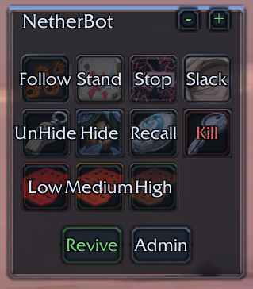
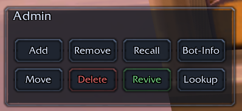
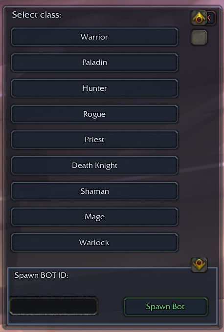
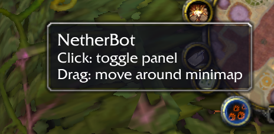

# BotSquad (NetherBot Reforged)

A World of Warcraft **3.3.5a** addon for fast control of **NPCBots** on TrinityCore / AzerothCore private servers. One-click access to the most common `.npcbot` commands: spawn, add, remove, recall, move, kill, follow/distance, revive, hide/show and a class-based bot lookup.

This is a **fork** of [NetherstormX/NetherBot](https://github.com/NetherstormX/NetherBot) with a rewritten UI and a number of fixes and additions. See [Origin & changes](#origin--changes) for the full comparison.

<p align="center">
  
  
</p>
<p align="center">
  
  
</p>

## Features

- Compact, movable dark-themed panel with the most used NPCBot commands:
  - **Follow / Stand / Stop / Slack** bot behaviour
  - **UnHide / Hide / Recall / Kill** bot management
  - **Low / Medium / High** follow distance (30 / 50 / 85 yd)
  - **Revive** and **Admin** quick actions
- **Admin panel** with Add, Remove, Recall, Bot-Info, Move, Delete (with confirmation), Revive, Lookup.
  Add/Remove/Delete work on your current target or by manually entered bot ID.
- **Lookup panel**: scrollable, sorted class list (18 classes incl. custom NPCBots classes) with mouse-wheel support, plus a "Spawn BOT ID" box.
- **Minimap button**: click to toggle the panel, drag to reposition (position is saved).
- Panels are **drag-movable**, **scalable** (`+`/`-`, 0.5–2.0), state is saved per character in `BotSquadDB`.
- Tooltips on every button showing the exact command being sent.
- i18n: English, French, German, Italian, zh-CN, zh-TW.
- Slash commands: `/botsquad` and `/nb`.

## Tested On

- AzerothCore rev. b45a3fcac97b (2023-08-13 22:38:53 +0700, AzerothCore branch), Win64, Release, Static
- NPCBots module (Trinity-Bots), Eluna 5.1

## Quick Start

1. Copy the **BotSquad** folder into your World of Warcraft `Interface/Addons` directory:
   ```
   Interface/Addons/BotSquad/
   ```
2. Start the game and enable **BotSquad** in the addon list.
3. In-game, open the panel:
   ```
   /nb
   ```
   (or click the minimap button).

That's it — target a bot and press a button, or click `Lookup` → pick a class → click a bot in the result list.

## Tech Stack

- Client: World of Warcraft **WotLK 3.3.5a** (build 12340)
- Server: AzerothCore / TrinityCore with the **NPCBots** module ([trickerer/Trinity-Bots](https://github.com/trickerer/Trinity-Bots))
- Language: **Lua 5.1**, WoW FrameXML API (`ActionButtonTemplate`-style frames, `SavedVariables`)
- `SavedVariables: BotSquadDB` (window position, scale, minimap angle)

## Usage

1. Open the main panel via `/nb`, `/botsquad show` or the minimap button.
2. **Bots behaviour** — Follow / Stand / Stop / Slack, distance Low/Medium/High.
3. **Management** — UnHide, Hide, Recall, Kill. Revive to resurrect dead bots.
4. **Admin** — Add/Remove/Delete with a target or by bot ID; Move, Bot-Info (prints `.npcbot info`), Recall, Revive, Lookup.
5. **Lookup** — pick a class to run `.npcbot lookup <id>`; the spawn bar runs `.npcbot spawn <id>`.

All commands are sent via `/say` chat and executed by the server's `.npcbot` commands (GM level required on your account).

## Slash Commands

| Command | Action |
|---|---|
| `/nb` or `/botsquad` | toggle panel on/off |
| `/botsquad show` | show the panel |
| `/botsquad hide` | hide all panels |

## Origin & changes

This project is a fork of the MIT-unspecified [NetherstormX/NetherBot](https://github.com/NetherstormX/NetherBot)
(locale files and the class/lookup concept are kept). The main script was **rewritten from scratch** and a
minimap button module was added.

### Rewritten
- The original `netherbot.lua` was a single monolithic file (action buttons + raid frames + lookup all mixed together).
  Now it is structured: a `STYLE` theme table, reusable helpers (`MakeButton`, `MakeText`, `SetPanelBackdrop`, `Command`).
- New dark UI theme with accent bar, hover states and tooltips on every button.
- Compact panel layout (4×3 button grid + footer) instead of the oversized 200×200 frame.
- Panels are drag-movable and scalable; position/scale are saved (`BotSquadDB`).

### Fixed bugs from the original
- `NetherbotDB = {}` discarded saved settings on every load → now `BotSquadDB = BotSquadDB or {}`.
- Recall buttons sent the typo'd command `.npcbot recal teleport` → now `.npcbot recall teleport`.
- Add/Remove/Delete with a target sent an **empty** command (`.npcbot add `) — the target name was only
  echoed to chat. Now the target name is really inserted into the command.
- "Spawn Bot" sent its command to the **Guild** channel → now uses `/say`.
- Class lookup list was built with `pairs()`, so the class order was random every login → classes are now
  sorted by id and the list is scrollable (9 visible rows, mouse-wheel support).
- Slash command only accepted `show`/`hide` → now toggles and has a `/nb` alias.

### Added
- `minimapbutton.lua` (new file): minimap toggle button, draggable, angle is saved.
- **Kill** button (`.npcbot kill`, red/danger) — replaces the original Unbind button.
- **Revive** button in the main footer and in the admin panel.
- Delete confirmation popup, generic bot-ID prompt dialog (one code path for add/remove/delete).

### Removed on purpose
- The built-in **raid frames** (`TeamFrame` + `RaidFrame` button) — dropped for a cleaner, self-contained panel.
- The `Redemption` spell button (spell 7328) and the `Unbind` button.

## Acknowledgements

- Original addon: [NetherstormX/NetherBot](https://github.com/NetherstormX/NetherBot)
- NPCBots module: [trickerer/Trinity-Bots](https://github.com/trickerer/Trinity-Bots)

## License

The original repository ([NetherstormX/NetherBot](https://github.com/NetherstormX/NetherBot)) does not
declare a license. The kept parts remain the intellectual property of their original author: © NetherstormX.

This fork's modifications: © JackD2020, licensed under the **MIT License** (see `LICENSE`). For the parts
taken from the original, respect the original author's rights.

---

# BotSquad (NetherBot Reforged) — описание на русском

Аддон для World of Warcraft **3.3.5a** для быстрого управления **NPCBots** на приватных серверах
TrinityCore / AzerothCore. Одна кнопка — нужная `.npcbot`-команда: спавн, добавление, удаление,
призыв, перемещение, килл, следование/дистанция, воскрешение, скрытие/показ и поиск ботов по классу.

Это **форк** [NetherstormX/NetherBot](https://github.com/NetherstormX/NetherBot) с переписанным
интерфейсом и рядом исправлений и дополнений. Полное сравнение — ниже, в разделе
[Откуда исходник и что изменено](#откуда-исходник-и-что-изменено).

## Возможности

- Компактная перетаскиваемая панель в тёмной теме с самыми нужными командами NPCBots:
  - **Follow / Stand / Stop / Slack** — поведение ботов
  - **UnHide / Hide / Recall / Kill** — управление ботами
  - **Low / Medium / High** — дистанция следования (30 / 50 / 85 ярдов)
  - **Revive** и **Admin** — быстрые действия
- **Админ-панель**: Add, Remove, Recall, Bot-Info, Move, Delete (с подтверждением), Revive, Lookup.
  Add/Remove/Delete работают по текущей цели или по вручную введённому ID бота.
- **Панель поиска (Lookup)**: прокручиваемый отсортированный список классов (18 классов, включая
  кастомные классы NPCBots) с колесом мыши + поле «Spawn BOT ID».
- **Кнопка на миникарте**: клик открывает/закрывает панель, перетаскивание меняет позицию (сохраняется).
- Панели **перетаскиваются** и **масштабируются** (`+`/`-`, 0.5–2.0), состояние сохраняется на персонажа
  в `BotSquadDB`.
- Тултипы на каждой кнопке показывают точную отправляемую команду.
- i18n: английский, французский, немецкий, итальянский, zh-CN, zh-TW.
- Slash-команды: `/botsquad` и `/nb`.

## Проверено на

- AzerothCore rev. b45a3fcac97b (2023-08-13 22:38:53 +0700, ветка AzerothCore), Win64, Release, Static
- Модуль NPCBots (Trinity-Bots), Eluna 5.1

## Быстрый старт

1. Скопируйте папку **BotSquad** в каталог аддонов World of Warcraft:
   ```
   Interface/Addons/BotSquad/
   ```
2. Запустите игру и включите аддон **BotSquad** в списке аддонов.
3. Откройте панель в игре:
   ```
   /nb
   ```
   (или кликните по кнопке на миникарте).

Всё — наведитесь на бота и жмите кнопку, либо откройте `Lookup` → выберите класс → кликните по боту в списке.

## Технологии

- Клиент: World of Warcraft **WotLK 3.3.5a** (build 12340)
- Сервер: AzerothCore / TrinityCore с модулем **NPCBots** ([trickerer/Trinity-Bots](https://github.com/trickerer/Trinity-Bots))
- Язык: **Lua 5.1**, WoW FrameXML API, `SavedVariables`
- `SavedVariables: BotSquadDB` (позиция окна, масштаб, угол кнопки на миникарте)

## Использование

1. Панель открывается через `/nb`, `/botsquad show` или кнопку на миникарте.
2. **Поведение ботов** — Follow / Stand / Stop / Slack, дистанция Low / Medium / High.
3. **Управление** — UnHide, Hide, Recall, Kill; Revive воскрешает мёртвых ботов.
4. **Admin** — Add/Remove/Delete по цели или ID бота; Move, Bot-Info (выполняет `.npcbot info`),
   Recall, Revive, Lookup.
5. **Lookup** — выбор класса запускает `.npcbot lookup <id>`; поле спавна выполняет `.npcbot spawn <id>`.

Все команды отправляются через чат `/say` и выполняются сервером (требуется ГМ-уровень на аккаунте).

## Slash-команды

| Команда | Действие |
|---|---|
| `/nb` или `/botsquad` | показать/скрыть панель |
| `/botsquad show` | показать панель |
| `/botsquad hide` | скрыть все панели |

## Откуда исходник и что изменено

Этот проект — форк [NetherstormX/NetherBot](https://github.com/NetherstormX/NetherBot)
(файлы локалей и идея поиска по классам сохранены). Основной скрипт **переписан с нуля**, добавлен
модуль кнопки на миникарте.

### Переписано
- Оригинальный `netherbot.lua` был единым монолитным файлом (кнопки + рейд-фреймы + поиск вперемешку). Теперь код
  структурирован: таблица стилей `STYLE`, переиспользуемые хелперы (`MakeButton`, `MakeText`,
  `SetPanelBackdrop`, `Command`).
- Новая тёмная тема с акцентной полосой, подсветкой при наведении и тултипами на каждой кнопке.
- Компактная раскладка панели (сетка кнопок 4×3 + нижняя панель) вместо громоздкой рамки 200×200.
- Панели перетаскиваются и масштабируются; позиция/масштаб сохраняются (`BotSquadDB`).

### Исправленные баги оригинала
- `NetherbotDB = {}` сбрасывал сохранённые настройки при каждом запуске → теперь `BotSquadDB = BotSquadDB or {}`.
- Кнопки Recall отправляли команду с опечаткой `.npcbot recal teleport` → теперь `.npcbot recall teleport`.
- Add/Remove/Delete по цели отправляли **пустую** команду (`.npcbot add `) — имя цели только
  выводилось в чат. Теперь имя цели реально подставляется в команду.
- Кнопка «Spawn Bot» отправляла команду в канал **Guild** → теперь `/say`.
- Список классов строился через `pairs()`, из-за чего порядок был случайным при каждом входе →
  теперь классы отсортированы по id, список прокручивается (9 видимых строк, колесо мыши).
- Slash-команда принимала только `show`/`hide` → теперь умеет переключать и имеет алиас `/nb`.

### Добавлено
- `minimapbutton.lua` (новый файл): кнопка на миникарте, перетаскивается, угол сохраняется.
- Кнопка **Kill** (`.npcbot kill`, красная) — заменяет кнопку Unbind из оригинала.
- Кнопка **Revive** в нижней панели и в админ-панели.
- Диалог подтверждения удаления, универсальный диалог ввода ID бота (единый код для add/remove/delete).

### Убрано намеренно
- Встроенные **рейд-фреймы** (`TeamFrame` + кнопка `RaidFrame`) — убраны в пользу более чистой и
  самодостаточной панели.
- Кнопка заклинания `Redemption` (spell 7328) и кнопка `Unbind`.

## Благодарности

- Оригинальный аддон: [NetherstormX/NetherBot](https://github.com/NetherstormX/NetherBot)
- Модуль NPCBots: [trickerer/Trinity-Bots](https://github.com/trickerer/Trinity-Bots)

## Лицензия

В оригинальном репозитории ([NetherstormX/NetherBot](https://github.com/NetherstormX/NetherBot))
лицензия не объявлена. Сохранённые части остаются интеллектуальной собственностью оригинального
автора: © NetherstormX.

Изменения этого форка: © JackD2020, распространены по лицензии **MIT** (см. `LICENSE`). В отношении
частей, взятых из оригинала, соблюдайте права оригинального автора.